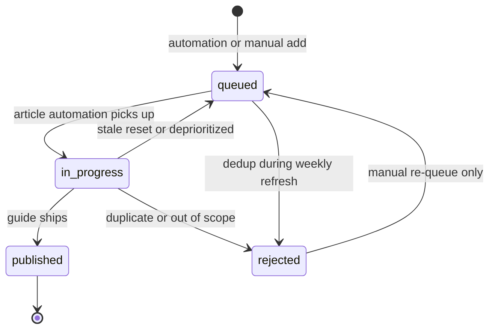

# SEO Topic Queue

The topic queue is eBikeQuest's prioritized backlog of guide ideas. It tracks **what to write next**, not the articles themselves. A weekly Cursor Automation refreshes the queue and opens a PR; separate article automations consume scheduled items.

## Files

| File | Purpose |
|------|---------|
| [`topic-queue.json`](topic-queue.json) | Active backlog: proposed topics, priorities, internal link plans, and workflow status |
| [`published-keywords.json`](published-keywords.json) | Keywords and slugs already live on the site — used to prevent duplicates and cannibalization |

## Topic lifecycle



### Status transitions

| From | Allowed to | Who |
|------|------------|-----|
| `queued` | `in-progress`, `rejected` | Article automation, weekly planner |
| `in-progress` | `queued`, `published`, `rejected` | Article automation, manual edit |
| `published` | *(terminal)* | Manual — item stays for history |
| `rejected` | `queued` | Manual re-queue only |

### Status meanings

- **queued** — Approved for future writing; eligible for `scheduledFor` assignment.
- **in-progress** — An article automation is drafting this topic. Stale items (>7 days) reset to `queued` during the weekly refresh.
- **published** — Guide is live. `proposedSlug` must appear in `published-keywords.json` or `content/guides/index.ts`.
- **rejected** — Skipped (duplicate, cannibalization, or out of scope). Not scheduled.

## `primaryUrlOwner`

Declares which URL should rank for the target keyword:

| Value | Meaning |
|-------|---------|
| `new-guide` | A new guide at `/guides/{proposedSlug}` |
| `{existing-guide-slug}` | Defer to an existing guide (avoid adding competing topics) |
| `law-page` | Jurisdiction law page at `/laws/{jurisdiction}` |
| `trail-page` | Trail detail page at `/trails/{jurisdiction}/{slug}` |

When adding topics, set `competingUrlsOnSite` if an existing page partially overlaps, and prefer linking to it via `internalLinks` instead of creating a cannibalizing guide.

## Priority and scheduling

- **priority** (1–100): Higher = more valuable. Weekly automation re-scores the top 10 queued items.
- **scheduledFor**: ISO date assigned to the top 2 queued items after each refresh. These feed Tue/Fri article automations.

## Weekly automation workflow

Every Monday, the **eBikeQuest Weekly Topic Planner** automation:

1. Reads this queue, `published-keywords.json`, existing guides, and editorial standards
2. Researches 5–10 new niche Mid-Atlantic e-bike keywords
3. Dedups against published keywords and guide slugs
4. Adds new topics with internal link plans and source hints
5. Re-scores the top 10 queued items and schedules the next 2
6. Resets stale `in-progress` items (>7 days) to `queued`
7. Runs `npm run validate:seo`
8. Opens a PR titled `seo: refresh topic queue YYYY-MM-DD` — **does not merge**

Import the automation in Cursor via [`automation-draft.json`](automation-draft.json) (cron: Mondays 09:00 UTC — adjust for Eastern Time in the editor).

## Manual workflow when a guide ships

1. Move the topic's `status` to `published` in `topic-queue.json`
2. Add an entry to `published-keywords.json` with `targetKeyword`, `slug`, `title`, `category`, and `publishedAt`
3. Run `npm run validate:seo` before committing

## Validation

```bash
npm run validate:seo
```

Checks unique IDs/slugs, valid categories and jurisdictions, no conflicts with live guides, keyword deduplication, internal link integrity, and status consistency. Also runs automatically before Vercel builds.

## Future improvement

Split [`content/guides/index.ts`](../guides/index.ts) into per-guide files so automation PRs produce smaller, reviewable diffs.
