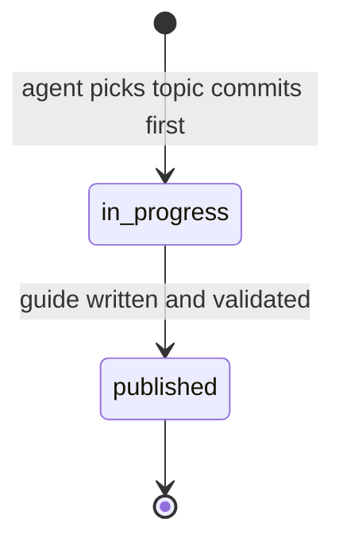

# Guide Writer Playbook

Automation and human editors use this document when producing guides from [`topic-queue.json`](topic-queue.json). Read it alongside [`content/editorial/editorial-standards.ts`](../editorial/editorial-standards.ts).

## Quality bar

Match the depth and tone of [`content/guides/entries/ebike-classes-explained.ts`](../guides/entries/ebike-classes-explained.ts):

- Statute citations with section numbers (e.g. Virginia Code § 46.2-904.1, D.C. Code § 50-2201.02)
- Jurisdiction nuance — especially DC's speed-based definition vs Virginia/Maryland three-class framework
- Practical rider advice tied to real trails and law pages
- No filler, no generic national content eBikeQuest cannot substantiate

## Required Guide fields

Each guide lives in `content/guides/entries/{slug}.ts` and must satisfy [`scripts/validate-content.ts`](../../scripts/validate-content.ts):

| Field | Requirement |
|-------|-------------|
| `...EDITORIAL_DEFAULTS` | Spread first; override `publishedAt`, `updatedAt`, and `reviewedBy` to today's date |
| `id` | `"guide-{slug-with-dashes}"` (slug without redundant prefix if already descriptive) |
| `title`, `slug`, `category` | From topic queue entry |
| `description` | **Exactly 120–160 characters** (meta description length) |
| `readingTimeMinutes` | `Math.ceil(totalWordCount / 200)` |
| `sections` | Minimum **6** sections; each with `id`, `heading`, `paragraphs[]`; optional `listItems[]` |
| `faq` | Minimum **4** items |
| Word count | Minimum **1000** words across all section `paragraphs` and `listItems` |
| `relatedGuides` | From topic `internalLinks.guides` |
| `relatedTrails` | Trail **slugs only** from topic `internalLinks.trails[].slug` |
| `jurisdictions` | From topic when applicable |

Register every new entry in [`content/guides/index.ts`](../guides/index.ts) (import + array entry).

## Source hierarchy

1. **Primary:** State/federal statutes, municipal regulations (DCMR), land-manager compendiums (NPS, NOVA Parks, Montgomery Parks, DDOT)
2. **Secondary:** Official agency FAQ pages and published policy PDFs
3. **Never alone:** Forums, Reddit, dealer blogs, news articles without primary confirmation

For legal claims, cite the specific statute or agency document. When trail policies are ambiguous, state uncertainty explicitly rather than guessing.

## Jurisdiction nuance

- **Virginia & Maryland** use the PeopleForBikes three-class framework in statute.
- **Washington, DC** defines a **motorized bicycle** by a **20 mph cap** (D.C. Code § 50-2201.02(11A)) — it does not adopt Class 1/2/3 labels in code. A stock Class 3 e-bike designed to assist to 28 mph may exceed DC's motorized-bicycle definition; published DC enforcement guidance on privately owned Class 3 pedal-assist bikes is limited — say so when relevant.
- **Federal lands** (NPS units, C&O Canal, Rock Creek Park segments) follow superintendent compendiums that can be stricter than DC or state law.
- **Restrictive rule wins:** When policies conflict, the most restrictive applicable rule governs at each boundary.

## Internal links from topic queue

Map `topic.internalLinks` to guide content:

| Queue field | Guide field | In prose |
|-------------|-------------|----------|
| `guides[]` | `relatedGuides` | Link to `/guides/{slug}` when mentioning peer topics |
| `trails[]` | `relatedTrails` (slug only) | Link to `/trails/{jurisdiction}/{slug}` |
| `laws[]` | — | Link to `/laws/{jurisdiction}` when discussing statutes |

**Minimum:** Every guide must reference at least **2 other site pages** (guide, trail, or law) in prose or structured links.

## Law page boundary

Guides **complement** [`/laws/{jurisdiction}`](/laws/virginia) pages — they do not replace them.

- Law pages: structured statute summaries, FAQ hubs, jurisdiction-wide rules
- Guides: deep-dive angles, trail-specific access, rider how-to, comparisons across jurisdictions

Do not duplicate entire law-page summaries. Link to the law page and add value the law hub does not cover.

## Topic lifecycle



1. **Pick** — Highest-priority `queued` item where `scheduledFor` is today or earlier (or null).
2. **Claim** — Set `status: "in-progress"` in `topic-queue.json` and commit immediately (prevents duplicate picks).
3. **Write** — Create `content/guides/entries/{proposedSlug}.ts`; register in `index.ts`.
4. **Publish queue** — Set topic `status: "published"`, `publishedAt: "YYYY-MM-DD"`, `scheduledFor: null`.
5. **Publish keywords** — Append entry to [`published-keywords.json`](published-keywords.json).

## Validation before PR

```bash
npm run validate:seo
npm run validate:content
npm run build
```

Fix all errors. Warnings in unrelated trail geometry are pre-existing — do not introduce new content errors.

## PR checklist

- [ ] Title: `guide: {Guide Title}`
- [ ] Label: `seo-automation` (create label in repo settings if missing)
- [ ] Body includes: target keyword, word count, internal links added, sources cited
- [ ] Note: **"Needs human review before merge — verify legal claims"**
- [ ] Do **not** merge to `main`
- [ ] Do **not** open PR if validation fails

## Voice

- Second person ("you") for rider-facing advice; third person for statute summaries
- Active voice; short paragraphs (2–4 sentences)
- Name trails, agencies, and code sections precisely
- Acknowledge when policies may have changed — direct readers to trailhead signage and official sources
